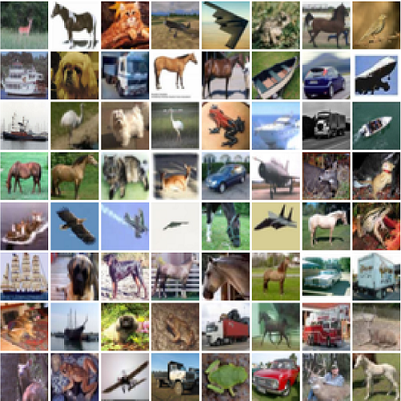
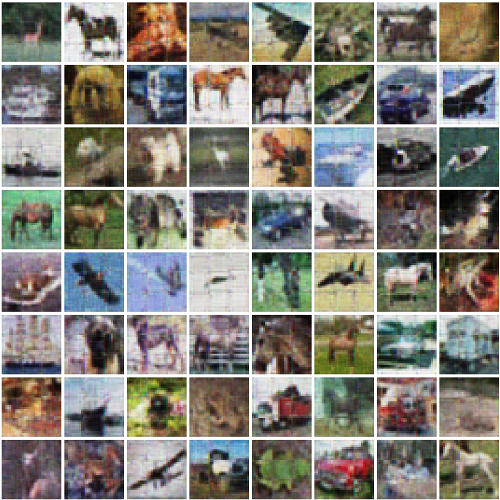

# CIFAR-10 Autoencoder
##### My implementation of a deep autoencoder on the CIFAR-10 dataset.

This repository houses my autoencoder model that is trained on the CIFAR-10 dataset. The model is constructed using 
*Pytorch*. The initial results are provided below. These results are acquired using
'Model_3conv'

Inputs             |  Outputs
:-------------------------:|:-------------------------:
  | 

### Model architecture:
```
Autoencoder(
  (encoder): Sequential(
    (0): Conv2d(3, 32, kernel_size=(4, 4), stride=(1, 1))
    (1): ReLU(inplace=True)
    (2): BatchNorm2d(32, eps=1e-05, momentum=0.1, affine=True, track_running_stats=True)
    (3): Conv2d(32, 16, kernel_size=(6, 6), stride=(1, 1))
    (4): ReLU(inplace=True)
    (5): BatchNorm2d(16, eps=1e-05, momentum=0.1, affine=True, track_running_stats=True)
    (6): Conv2d(16, 8, kernel_size=(2, 2), stride=(2, 2))
  )
  (decoder): Sequential(
    (0): ConvTranspose2d(8, 16, kernel_size=(5, 5), stride=(1, 1))
    (1): ReLU(inplace=True)
    (2): BatchNorm2d(16, eps=1e-05, momentum=0.1, affine=True, track_running_stats=True)
    (3): Conv2d(16, 32, kernel_size=(3, 3), stride=(1, 1))
    (4): ReLU(inplace=True)
    (5): BatchNorm2d(32, eps=1e-05, momentum=0.1, affine=True, track_running_stats=True)
    (6): ConvTranspose2d(32, 32, kernel_size=(2, 2), stride=(2, 2))
    (7): ReLU(inplace=True)
    (8): ConvTranspose2d(32, 3, kernel_size=(5, 5), stride=(1, 1))
    (9): Sigmoid()
  )
)

```
